# Confusion matrices

Confusion matrices for Stacked predictor and sub-layers on mixed dataset

## Stacked predictor

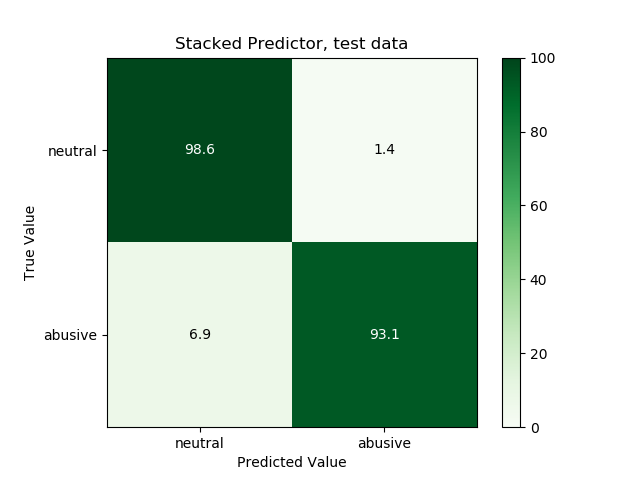  

## Derived Sub-Layers

  
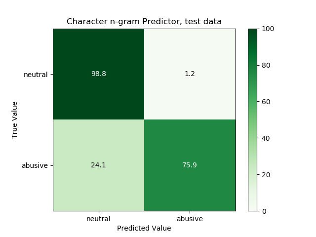  
  
  
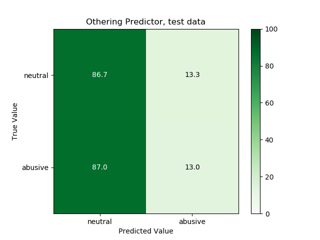  
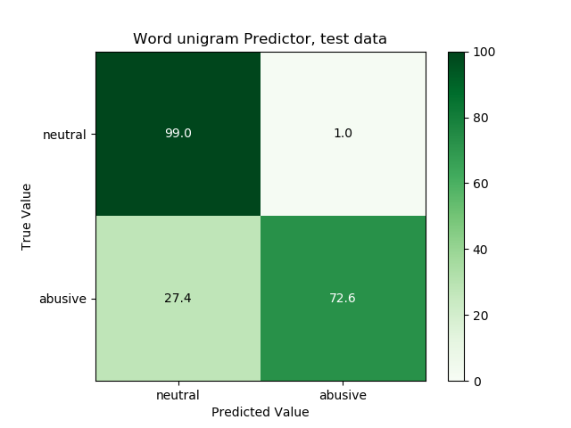  

## Emotion Sub-Layers

  
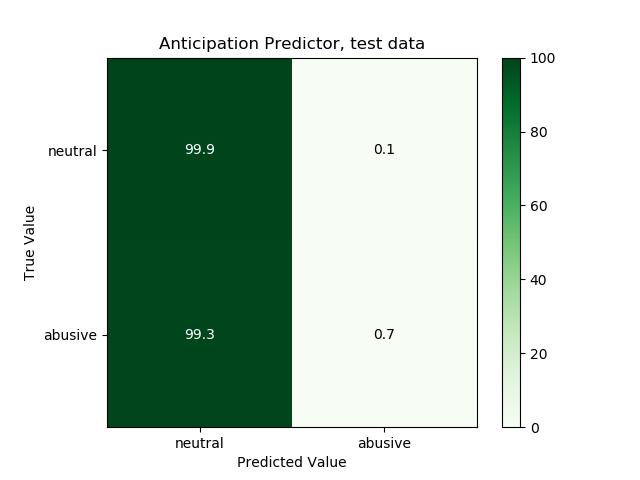  
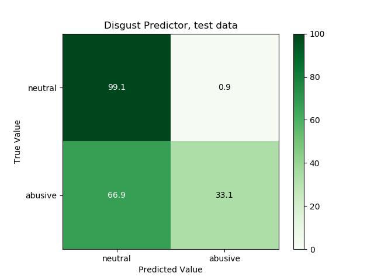  
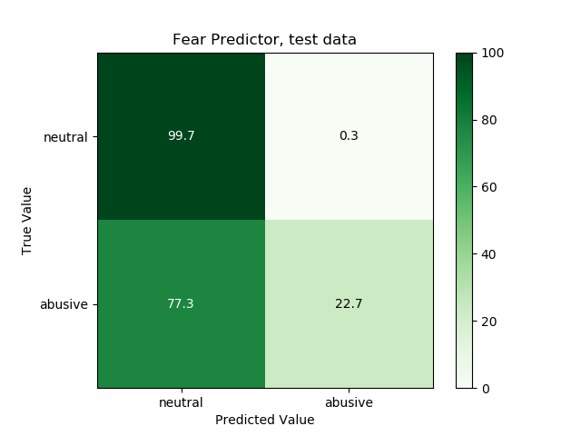  
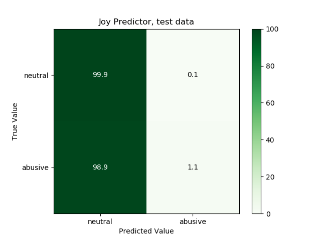  
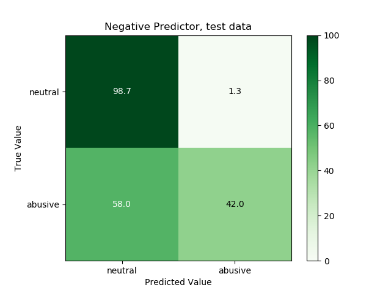  
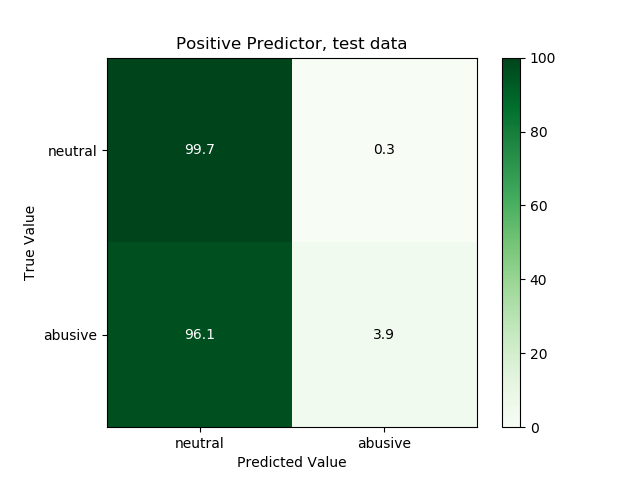  
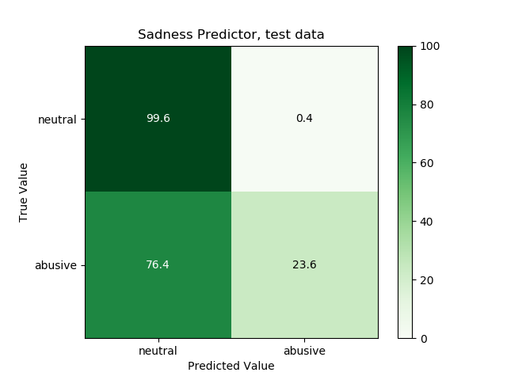  
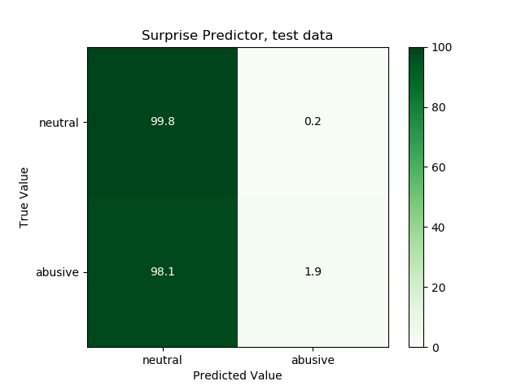  
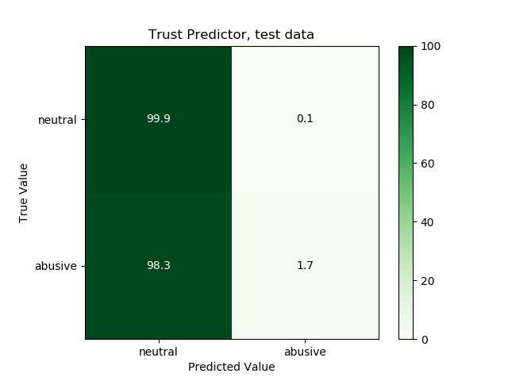  

## Lexicon Sub-Layers

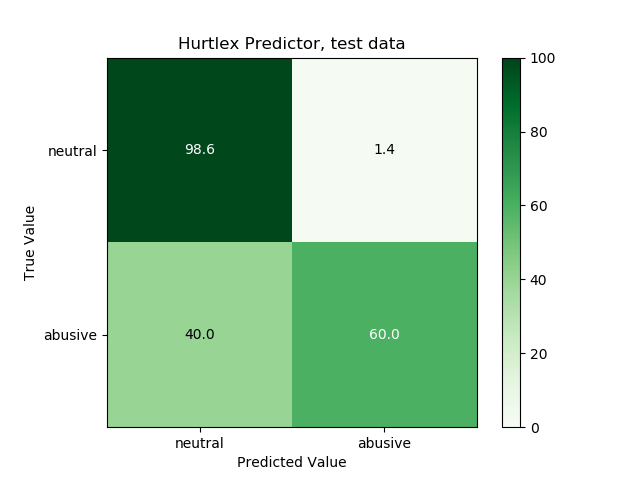  
  
