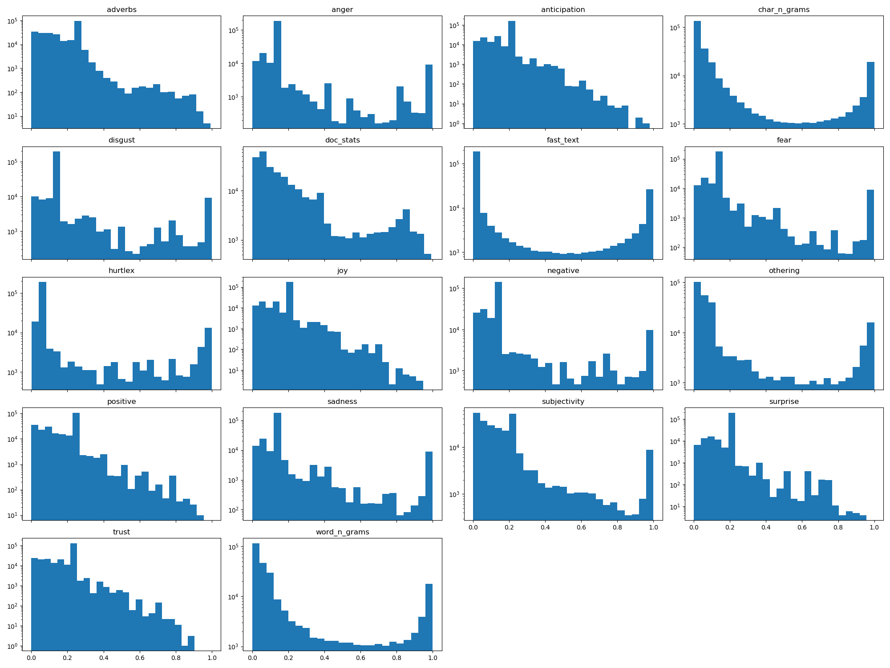

# Prediciton summaries

# Model accuracies

| Layer               | Accuracy   |
| ------------------- | :---------:|
| Stacked             | 94.9%      |
|                     |            |
| Adverbs             | 82.3%      |
| Character n-grams   | 94.4%      |
| Document Statistics | 86.6%      |
| Othering            | 74.2%      |
| Word n-grams        | 94.1%      |
| Anger               | 87.3%      |
| Anticipation        | 82.7%      |
| Disgust             | 87.7%      |
| Fear                | 86.4%      |
| Joy                 | 82.7%      |
| Negative            | 88.8%      |
| Positive            | 83.0%      |
| Sadness             | 86.5%      |
| Surprise            | 82.8%      |
| Trust               | 82.8%      |
| Hurtlex             | 91.8%      |
| Subjectivity        | 87.7%      |
| BiLSTM              | 94.9%      |

## Histogram of predictions
  

